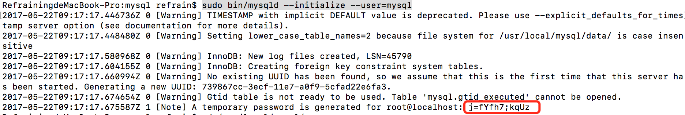
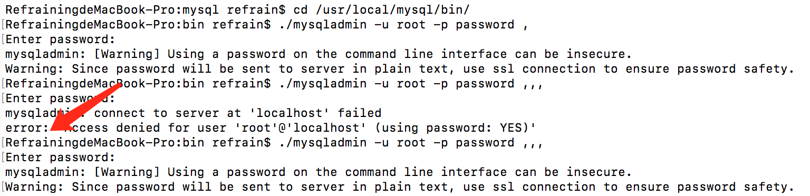

### Mac 以tar.gz方式安装 MySQL 5.7

怎么安装个MySQL 这么麻烦，瞎整了好久也没弄明白，还好找到了 [Mac OS X 下 TAR.GZ 方式安装 MySQL 5.7](https://www.widlabs.com/article/mac-os-x-install-mysql-57-with-tar-gz ) ，参考出来了。

1.    解压

      cd Download/

      tar zxvf mysql-5.7.18-macos10.12-x86_64.tar.gz 

      2.  移动解压后的二进制包到安装目录

     sudo mv mysql-5.7.18-macos10.12-x86_64 /usr//local/mysql

     ​

	3.  更改mysql安装目录所属用户与用户组

     cd /usr/local/

     chown -R root:wheel mysql

	4.  切换到mysql安装目录并执行初始化命令并生成临时的root密码

​        cd /usr/local/mysql/

​	sudo bin/mysqld --initialize --user=mysql	

5. 启动。重启、停止、当前状态

   cd /usr/local/mysql/

   5.1 启动

   sudo support-files/mysql.server start

   5.2 重启

   sudo support-files/mysql.server restart

   5.3 停止

   sudo support-files/mysql.server stop

   5.4 检查状态

   sudo support-files/mysql.server status

# 修改MySQL root 密码

需要在MySQL服务运行状态下

1. cd /usr/local/mysql/bin/

2. ./mysqladmin -u root -p password <新密码>

3. 输入生成的临时密码或旧密码

   

error: 表示输入密码不正确